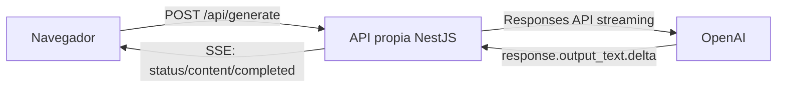

# Chat SSE

Aplicacion universitaria en NestJS y TypeScript que demuestra generacion progresiva desde OpenAI hacia el navegador mediante Server-Sent Events.

El backend recibe un prompt, abre un stream real con OpenAI Responses API y convierte cada delta de texto en eventos SSE propios. El navegador consume esos eventos con `fetch`, `ReadableStream` y `TextDecoder`, agregando cada fragmento apenas llega.

## Flujo



## Tecnologias

- NestJS
- TypeScript
- pnpm
- OpenAI SDK oficial
- OpenAI Responses API
- Server-Sent Events
- HTML
- CSS
- JavaScript vanilla
- @nestjs/config
- class-validator
- class-transformer

## Instalacion

```bash
pnpm install
```

## Configuracion

Copiar el archivo de ejemplo:

```bash
cp .env.example .env
```

En Windows PowerShell:

```powershell
Copy-Item .env.example .env
```

Configurar las variables:

```text
OPENAI_API_KEY=
OPENAI_MODEL=gpt-5.6-luna
```

`OPENAI_MODEL` permite cambiar el modelo sin modificar el codigo.

La API key pertenece exclusivamente al backend. No se envia al navegador, no aparece en `public/`, no se imprime en logs y `.env` esta excluido de Git.

## Ejecucion

```bash
pnpm run build
pnpm run start:dev
```

Abrir:

```text
http://localhost:3000
```

## Endpoint

```text
POST /api/generate
Content-Type: application/json
```

Body:

```json
{
  "message": "Explicame que es SSE"
}
```

Respuesta:

```text
Content-Type: text/event-stream; charset=utf-8
```

## Streaming SSE

El servidor no espera la respuesta completa. Cada evento `response.output_text.delta` recibido desde OpenAI se transforma inmediatamente en:

```text
event: content
data: {"delta":"..."}
```

El navegador mantiene un buffer de texto porque un chunk HTTP puede traer eventos incompletos. Cuando identifica un evento SSE completo, parsea `event:` y `data:`, convierte el JSON y agrega `data.delta` al area de respuesta.

## Estados

- `Esperando`: la solicitud fue enviada y el servidor preparo el stream.
- `Generando`: ya llego el primer delta real desde OpenAI.
- `Completado`: OpenAI finalizo correctamente.
- `Interrumpido`: el usuario cancelo la generacion.

## Cancelacion

Cada generacion del navegador usa su propio `AbortController`. Al presionar Detener, se aborta el `fetch`, se conserva el texto parcial y la interfaz muestra `Interrumpido`.

Cuando NestJS detecta el cierre prematuro de esa conexion HTTP, aborta el stream de OpenAI asociado a esa solicitud para evitar trabajo innecesario.

## Aislamiento de solicitudes simultaneas

Cada llamada a `POST /api/generate` mantiene de forma independiente su mensaje, `Request`, `Response`, `AbortController`, stream de OpenAI y estado de cierre. El servicio puede reutilizar el cliente OpenAI, pero no almacena streams, responses, mensajes ni controladores de generaciones como propiedades compartidas.

Esto permite abrir dos pestañas y generar respuestas al mismo tiempo sin mezclar fragmentos. Cancelar una pestaña solo cierra su propia solicitud.

## Seguridad y errores

Los errores enviados al navegador usan mensajes seguros. No se exponen stack traces, rutas locales, headers internos, variables de entorno, objetos completos del proveedor ni credenciales.

Si falta configuracion de OpenAI, la aplicacion compila y el navegador recibe un error controlado.

## Build

```bash
pnpm run build
```
